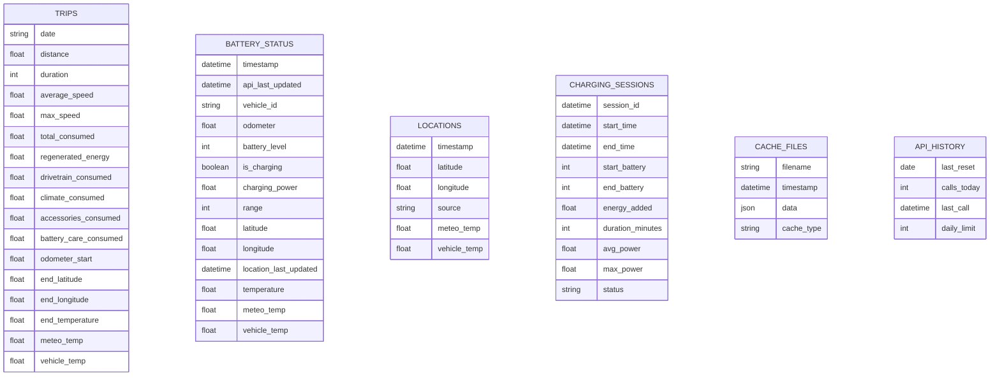

# PyVisionic Architecture Documentation

This document provides comprehensive architectural diagrams and technical documentation for the PyVisionic application.

## Table of Contents
- [System Architecture Overview](#system-architecture-overview)
- [Data Flow Diagram](#data-flow-diagram)
- [Web UI Architecture](#web-ui-architecture)
- [API Endpoints Structure](#api-endpoints-structure)
- [Data Storage Schema](#data-storage-schema)

## System Architecture Overview

The following diagram shows the complete system architecture including external services, internal components, and data flow:

## Data Flow Diagram

This sequence diagram illustrates how data flows through the system from collection to display:

## Web UI Architecture

The dashboard user interface structure and JavaScript interactions:

## API Endpoints Structure

The Flask application's API endpoints and their relationships to data sources:

## Data Storage Schema

The entity relationship diagram for PyVisionic's data storage:

## Key Features

### Data Collection
- **Rate Limited**: Respects Hyundai/Kia's 30 calls/day limit
- **Smart Scheduling**: Evenly distributes collections throughout the day (every 48 minutes)
- **Caching**: Maintains 48-hour cache to minimize API calls
- **Weather Integration**: Fetches temperature data from Open-Meteo API

### Data Storage
- **CSV Format**: Lightweight, portable data storage
- **Deduplication**: Prevents duplicate trip entries
- **Session Detection**: Automatically identifies charging sessions
- **Historical Data**: Maintains complete history for analysis

### Web Interface
- **Real-time Updates**: Live battery status and charging information
- **Interactive Charts**: Battery history, energy usage, temperature impact
- **Trip Management**: Paginated trip list with detailed views
- **Map Visualization**: Shows trip endpoints and current location
- **Unit Conversion**: Toggle between metric and imperial units

### API Design
- **RESTful**: Clean, predictable endpoint structure
- **JSON Responses**: Consistent data format
- **Error Handling**: Comprehensive error classification
- **Pagination**: Efficient handling of large datasets

## Security Considerations

1. **API Credentials**: Stored in environment variables
2. **SSL Support**: Custom SSL patching for API compatibility
3. **No Direct API Exposure**: All API calls go through the backend
4. **Rate Limit Protection**: Prevents exceeding API quotas

## Performance Optimizations

1. **Worker Configuration**: 4 Gunicorn workers with 2 threads each
2. **Chart Updates**: Modify existing charts instead of recreating
3. **Data Caching**: Reduces API calls and improves response times
4. **Lazy Loading**: Maps and charts load on demand
5. **Pagination**: Limits data transfer for large datasets

## Deployment

The application is containerized using Docker with:
- Python 3.11 slim base image
- Gunicorn WSGI server
- Background data collector process
- Volume mounts for persistent data
- Environment-based configuration

See `docker-compose.yml` for deployment configuration.