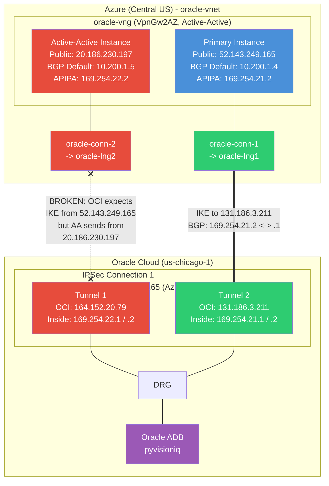
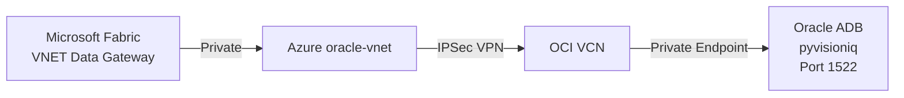

# Azure-to-OCI VPN Topology Documentation

## Network Topology Diagram



> **Legend**: Green = should work, Red = problem, Blue = Azure, Purple = Target

---

## Current Configuration (All Data Collected)

### Azure VPN Gateway

| Parameter | Value |
|---|---|
| **Name** | `oracle-vng` |
| **Resource Group** | `rg-oracle` |
| **Location** | Central US |
| **SKU** | VpnGw2AZ (Zone Redundant, Gen2) |
| **Type** | Route-Based VPN |
| **Active-Active** | Yes |
| **BGP Enabled** | Yes |
| **BGP ASN** | 65515 |
| **VNET** | `oracle-vnet` |

### Gateway Instances

| Instance | Public IP | Default BGP IP | Custom APIPA | Status |
|---|---|---|---|---|
| Primary (`default`) | `52.143.249.165` | `10.200.1.4` | `169.254.21.2` | Configured |
| Active-Active | `20.186.230.197` | `10.200.1.5` | `169.254.22.2` | Configured |

### Local Network Gateways

| Name | Gateway IP (OCI Public) | BGP ASN | BGP Peer IP |
|---|---|---|---|
| `oracle-lng1` | `131.186.3.211` | 31898 | `169.254.21.1` |
| `oracle-lng2` | `164.152.20.79` | 31898 | `169.254.22.1` |

### Connections

| Name | LNG | BGP | gatewayCustomBgpIpAddresses | Status |
|---|---|---|---|---|
| `oracle-conn-1` | `oracle-lng1` | Yes | **EMPTY** | Not Connected |
| `oracle-conn-2` | `oracle-lng2` | Yes | **EMPTY** | Not Connected |

### OCI IPSec Connection (CPE: 52.143.249.165)

| Parameter | Tunnel 1 | Tunnel 2 |
|---|---|---|
| **OCI VPN IP** | `164.152.20.79` | `131.186.3.211` |
| **CPE IP** | `52.143.249.165` | `52.143.249.165` |
| **IKE Version** | IKEv2 | IKEv2 |
| **Routing** | BGP | BGP |
| **CPE BGP ASN** | 65515 | 65515 |
| **OCI Inside IP** | `169.254.22.1` | `169.254.21.1` |
| **CPE Inside IP** | `169.254.22.2` | `169.254.21.2` |

---

## Issues Found (Prioritized)

### ISSUE 1: CRITICAL - gatewayCustomBgpIpAddresses Empty on Connections

- **Problem**: Both `oracle-conn-1` and `oracle-conn-2` have `gatewayCustomBgpIpAddresses: []`. With an active-active gateway using custom APIPA addresses, each connection MUST specify which gateway instance and APIPA address to use. Without this, Azure does not bind the APIPA addresses to the tunnels.
- **Impact**: Even though APIPA addresses are now configured on the gateway, the connections don't use them. BGP cannot peer.
- **Fix**:
  ```bash
  # Connection 1: oracle-lng1 (131.186.3.211) peers with 169.254.21.1
  # -> must use Primary instance APIPA 169.254.21.2
  az network vpn-connection update \
    --name oracle-conn-1 \
    --resource-group rg-oracle \
    --set gatewayCustomBgpIpAddresses='[{"ipConfigurationId":"/subscriptions/7a5070f6-d59a-4d42-b6db-4840a50bf513/resourceGroups/rg-oracle/providers/Microsoft.Network/virtualNetworkGateways/oracle-vng/ipConfigurations/default","customBgpIpAddress":"169.254.21.2"}]'

  # Connection 2: oracle-lng2 (164.152.20.79) peers with 169.254.22.1
  # -> must use Active-Active instance APIPA 169.254.22.2
  az network vpn-connection update \
    --name oracle-conn-2 \
    --resource-group rg-oracle \
    --set gatewayCustomBgpIpAddresses='[{"ipConfigurationId":"/subscriptions/7a5070f6-d59a-4d42-b6db-4840a50bf513/resourceGroups/rg-oracle/providers/Microsoft.Network/virtualNetworkGateways/oracle-vng/ipConfigurations/activeActive","customBgpIpAddress":"169.254.22.2"}]'
  ```

### ISSUE 2: CRITICAL - Active-Active Instance / OCI CPE Mismatch

- **Problem**: OCI **both tunnels** are configured with CPE = `52.143.249.165` (Azure Primary). But `oracle-conn-2` uses the Active-Active instance (`20.186.230.197`). When Azure's Active-Active instance tries to initiate IKE, it sends from `20.186.230.197` — OCI will **reject** this because the CPE is `52.143.249.165`.
- **Impact**: `oracle-conn-2` / OCI Tunnel 1 will NEVER establish IKE. Only `oracle-conn-1` / OCI Tunnel 2 can work.
- **Options**:

  **Option A (Recommended): Move both APIPA addresses to Primary instance, single connection handles both tunnels**
  - Since both OCI tunnels target `52.143.249.165`, put both APIAs on Primary:
    ```bash
    az network vnet-gateway update \
      --name oracle-vng \
      --resource-group rg-oracle \
      --set 'bgpSettings.bgpPeeringAddresses[0].customBgpIpAddresses=["169.254.21.2","169.254.22.2"]'
    ```
  - Then set BOTH connections to use the Primary instance (with different APIPA each)

  **Option B: Create second OCI CPE + IPSec for Active-Active IP**
  - Create OCI CPE with IP `20.186.230.197`
  - Create second OCI IPSec connection using that CPE
  - This properly uses both Azure instances (true active-active)

  **Option C (Simplest): Disable active-active on Azure**
  - Single instance, both tunnels connect to same IP, no ambiguity
  - Loses redundancy but simplest to get working

### ISSUE 3: RESOLVED - Missing APIPA BGP Addresses

- **Problem**: Azure VPN Gateway had no custom APIPA addresses.
- **Status**: FIXED. APIPA addresses now configured on both instances.

---

## Recommended Fix Path

### Quickest path to one working tunnel:

1. **Fix `oracle-conn-1` gatewayCustomBgpIpAddresses** (Issue 1 fix for conn-1 only):
   ```bash
   az network vpn-connection update \
     --name oracle-conn-1 \
     --resource-group rg-oracle \
     --set gatewayCustomBgpIpAddresses='[{"ipConfigurationId":"/subscriptions/7a5070f6-d59a-4d42-b6db-4840a50bf513/resourceGroups/rg-oracle/providers/Microsoft.Network/virtualNetworkGateways/oracle-vng/ipConfigurations/default","customBgpIpAddress":"169.254.21.2"}]'
   ```
   This should bring up:
   - `oracle-conn-1` -> `oracle-lng1` (131.186.3.211) -> OCI Tunnel 2
   - IKE: `52.143.249.165` <-> `131.186.3.211` (both match CPE)
   - BGP: `169.254.21.2` <-> `169.254.21.1` (matching /30)

2. **Verify tunnel comes up**, then decide on Option A/B/C for the second tunnel.

### Full active-active path (Option B):

1. Fix conn-1 as above
2. In OCI: Create CPE for `20.186.230.197`, create second IPSec connection
3. Create `oracle-lng3`, `oracle-lng4` for the new OCI tunnels
4. Create `oracle-conn-3`, `oracle-conn-4` using Active-Active instance

---

## Connection Wiring Diagram (Current vs Required)

### Current (BROKEN)

```
oracle-conn-1 -> oracle-lng1 (131.186.3.211, peer 169.254.21.1)
                 gateway APIPA: NOT SET
                 -> OCI Tunnel 2 expects IKE from 52.143.249.165
                 RESULT: IKE may start but BGP fails (no APIPA binding)

oracle-conn-2 -> oracle-lng2 (164.152.20.79, peer 169.254.22.1)
                 gateway APIPA: NOT SET
                 -> OCI Tunnel 1 expects IKE from 52.143.249.165
                 -> Active-Active sends from 20.186.230.197
                 RESULT: IKE rejected (IP mismatch)
```

### After Fix (conn-1 only, quickest win)

```
oracle-conn-1 -> oracle-lng1 (131.186.3.211, peer 169.254.21.1)
                 gateway APIPA: 169.254.21.2 (Primary instance)
                 -> IKE: 52.143.249.165 <-> 131.186.3.211
                 -> BGP: 169.254.21.2 <-> 169.254.21.1
                 RESULT: Should establish
```

---

## End-to-End Connectivity Goal



### Remaining steps after VPN is up:
1. Configure Oracle ADB with a private endpoint in the OCI VCN
2. Verify route propagation (BGP should advertise OCI VCN CIDR to Azure)
3. Test connectivity from Azure VNET to Oracle ADB private IP on port 1522
4. Create a VNET Data Gateway subnet in Azure (/28)
5. Create the VNET Data Gateway in Microsoft Fabric
6. Create an Oracle DB connection through the gateway

---

## Data Still Needed

- [ ] OCI VCN CIDR block
- [ ] Azure VNET full address space
- [ ] OCI DRG attachment and route table
- [ ] OCI Security List rules
- [ ] Second OCI IPSec connection (if pursuing Option B)
